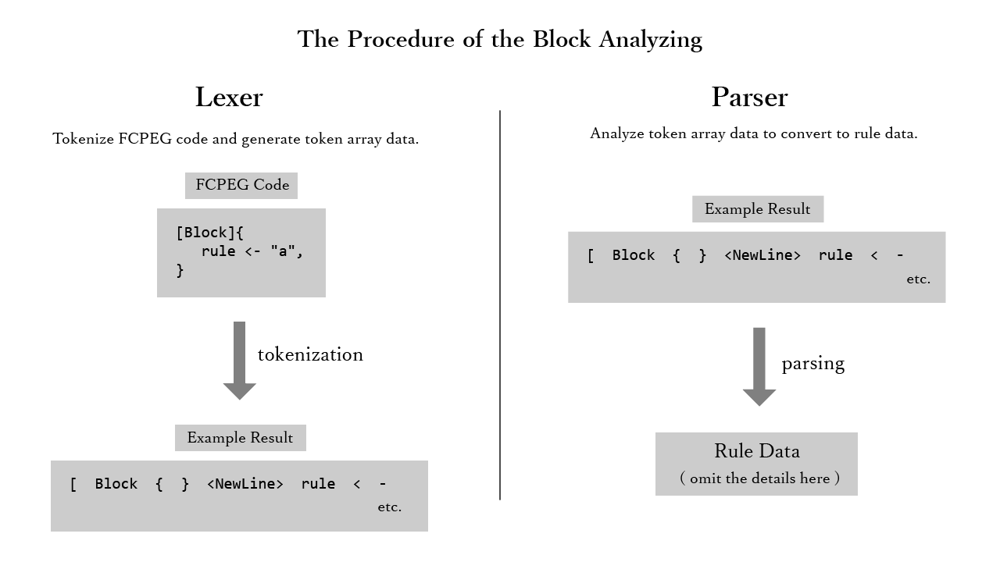

# ブロック解析器

## 概要

FCPEG コードを解析する。

おおまかな流れは以下のとおり:

- [字句解析器](lexer/index.md)  (lexer) で [トークン列データ](#トークン列データ) を生成し
- そのデータを元に [構文解析器](parser/index.md) (parser) で [ルールデータ](#ルールデータ) を生成する

この図ではそれぞれの処理手順を解説している:

## トークン列データ

複数のトークンの集合。

[ブロックレクサ (字句解析器) #トークン列データ](lexer/index.md#トークン列データ) を参照。

## ルールデータ

PEG ルールの情報をクラスまたは構造体を用いて格納したもの。

[ブロックパーサ (構文解析器) #ルールデータ](parser/index.md#ルールデータ) を参照。

## サブページ

- [ブロックレクサ (字句解析器)](lexer/index.md)
- [ブロックパーサ (構文解析器)](parser/index.md)
